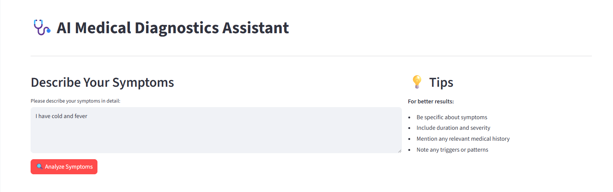
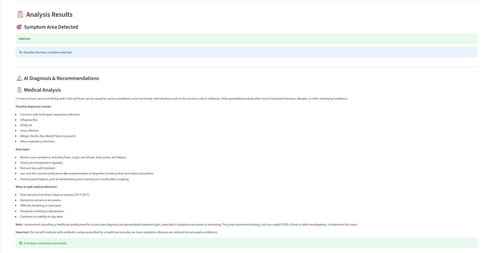

# 🩺 AI Medical Diagnostics System

An intelligent medical diagnostics assistant powered by **EuriAI** and **LangGraph** that analyzes symptoms and provides preliminary diagnostic suggestions with treatment recommendations.


## 🌟 Features

- **🤖 AI-Powered Diagnosis**: Uses EuriAI's advanced language models for medical analysis
- **🎯 Symptom Categorization**: Automatically categorizes symptoms into medical areas
- **📋 Detailed Recommendations**: Provides possible diagnoses, next steps, and treatment suggestions
- **🔄 Multi-Step Processing**: Uses LangGraph for structured diagnostic workflow
- **🌐 Web Interface**: User-friendly Streamlit frontend
- **⚡ Fast API Backend**: RESTful API built with FastAPI and LangServe
- **🔒 Secure**: Environment-based configuration for API keys
- **📱 Responsive Design**: Works on desktop and mobile devices

## 📸 Screenshots

### 🏠 Dashboard - User Input Interface
The main dashboard provides a clean, intuitive interface for users to describe their symptoms with helpful tips and validation.



*Features shown: Symptom input area, validation messages, helpful tips sidebar, and professional medical interface design.*

### 📋 Diagnosis Results - AI Analysis Output
The results page displays comprehensive AI-generated medical analysis with symptom categorization and detailed recommendations.



*Features shown: Symptom area detection, detailed AI diagnosis with treatment recommendations, medical disclaimer, and formatted medical advice.*

## 🏗️ Architecture

```
┌─────────────────┐    HTTP     ┌──────────────────┐    API     ┌─────────────┐
│   Streamlit     │ ──────────► │   FastAPI        │ ─────────► │   EuriAI    │
│   Frontend      │             │   Backend        │            │   API       │
│                 │             │                  │            │             │
│ • User Input    │             │ • LangGraph      │            │ • GPT-4.1   │
│ • Results UI    │             │ • LangServe      │            │ • Diagnosis │
│ • Validation    │             │ • Symptom Logic  │            │ • Analysis  │
└─────────────────┘             └──────────────────┘            └─────────────┘
```

### Workflow Process:
1. **User Input** → Symptom description via Streamlit UI
2. **Symptom Analysis** → Rule-based categorization (Infection, Respiratory, etc.)
3. **AI Diagnosis** → EuriAI generates detailed medical analysis
4. **Response** → Formatted results displayed to user

## 🚀 Quick Start

### Prerequisites

- Python 3.8 or higher
- EuriAI API key ([Get one here](https://euron.one))
- Git

### Installation

1. **Clone the repository**
   ```bash
   git clone https://github.com/HarishNandhan/AI_medical_diagnostic_system.git
   cd AI_medical_diagnostic_system
   ```

2. **Set up environment variables**
   ```bash
   # Create .env file in the root directory
   echo "EURI_API_KEY=your_api_key_here" > .env
   echo "EURI_DEFAULT_MODEL=gpt-4.1-nano" >> .env
   echo "EURI_BASE_URL=https://api.euron.one/api/v1/chat/completions" >> .env
   ```

3. **Install backend dependencies**
   ```bash
   cd langserve_backend
   pip install -r requirements.txt
   ```

4. **Install frontend dependencies**
   ```bash
   cd ../streamlit_ui
   pip install -r requirements.txt
   ```

### Running the Application

1. **Start the Backend Server**
   ```bash
   cd langserve_backend
   uvicorn main:app --host 127.0.0.1 --port 8000 --reload
   ```

2. **Start the Frontend (in a new terminal)**
   ```bash
   cd streamlit_ui
   streamlit run app.py
   ```

3. **Access the Application**
   - Frontend: http://localhost:8501
   - Backend API: http://localhost:8000
   - API Documentation: http://localhost:8000/docs

## 🛠️ Technology Stack

### Backend
- **[FastAPI](https://fastapi.tiangolo.com/)** - Modern, fast web framework for building APIs
- **[LangChain](https://langchain.com/)** - Framework for developing applications with language models
- **[LangGraph](https://langchain-ai.github.io/langgraph/)** - Library for building stateful, multi-actor applications
- **[LangServe](https://langchain-ai.github.io/langserve/)** - Deploy LangChain runnables and chains as REST API
- **[EuriAI](https://euron.one)** - Advanced AI language models for medical analysis
- **[Uvicorn](https://www.uvicorn.org/)** - ASGI server implementation

### Frontend
- **[Streamlit](https://streamlit.io/)** - Framework for building data applications
- **[Requests](https://requests.readthedocs.io/)** - HTTP library for API communication
- **[Python-dotenv](https://pypi.org/project/python-dotenv/)** - Environment variable management

### Development Tools
- **[Python 3.8+](https://python.org/)** - Programming language
- **[Git](https://git-scm.com/)** - Version control

## 📁 Project Structure

```
AI_medical_diagnostic_system/
├── 📁 langserve_backend/          # Backend API server
│   ├── 📄 main.py                 # FastAPI application entry point
│   ├── 📄 diagnostics_graph.py    # LangGraph workflow definition
│   ├── 📄 requirements.txt        # Backend dependencies
│   ├── 📁 tools/                  # Diagnostic tools
│   │   ├── 📄 diagnostic_tool.py  # AI diagnosis tool
│   │   └── 📄 symptom_checker.py  # Symptom categorization
│   └── 📁 utils/                  # Utility modules
│       └── 📄 euri_client.py      # EuriAI API client
├── 📁 streamlit_ui/               # Frontend web interface
│   ├── 📄 app.py                  # Streamlit application
│   └── 📄 requirements.txt        # Frontend dependencies
├── 📁 screenshots/                # Application screenshots
├── 📄 .env                        # Environment variables (create this)
├── 📄 .gitignore                  # Git ignore rules
├── 📄 test_euri_api.py           # API testing script
└── 📄 README.md                   # This file
```

## 🔧 Configuration

### Environment Variables

Create a `.env` file in the root directory with the following variables:

```env
# EuriAI Configuration
EURI_API_KEY=your_euri_api_key_here
EURI_DEFAULT_MODEL=gpt-4.1-nano
EURI_BASE_URL=https://api.euron.one/api/v1/chat/completions

# Optional: Backend URL for frontend
BACKEND_URL=http://127.0.0.1:8000
```

### Available Models

The system supports various EuriAI models:
- `gpt-4.1-nano` (Default - Fast and efficient)
- `gemini-2.0-flash-001` (Google's Gemini)
- `llama-4-maverick` (Meta's Llama)

## 🧪 Testing

### Test API Connection
```bash
python test_euri_api.py
```

### Test Backend Health
```bash
curl http://127.0.0.1:8000/health
```

### Manual Testing
1. Start both backend and frontend
2. Enter symptoms like:
   - "I have fever and body aches"
   - "I have a persistent cough and sore throat"
   - "I have severe headaches and feel dizzy"
   - "I have stomach pain and nausea"

## 📊 Symptom Categories

The system categorizes symptoms into the following medical areas:

| Category | Keywords | Example Symptoms |
|----------|----------|------------------|
| **Infection** | fever, body ache, chills | "I have fever and body aches" |
| **Respiratory** | throat, cough | "I have a persistent cough" |
| **Neurological** | headache, dizzy | "I have severe headaches" |
| **Gastrointestinal** | stomach, nausea | "I have stomach pain and nausea" |
| **General** | Other symptoms | Requires general examination |

## 🔒 Security & Privacy

- **API Key Protection**: Sensitive credentials stored in environment variables
- **No Data Storage**: No personal health information is stored
- **HTTPS Communication**: Secure API communication with EuriAI
- **Input Validation**: Frontend validates user input before processing

## 🚨 Medical Disclaimer

**⚠️ IMPORTANT**: This application is for **informational purposes only** and should **NOT** replace professional medical advice, diagnosis, or treatment. Always consult qualified healthcare professionals for medical concerns.

## 🐛 Troubleshooting

### Common Issues

1. **Backend 500 Error**
   - Check if EuriAI API key is correctly set in `.env`
   - Verify API endpoint URL is correct
   - Run `python test_euri_api.py` to test API connection

2. **Frontend Connection Error**
   - Ensure backend is running on port 8000
   - Check `BACKEND_URL` in `.env` file
   - Verify no firewall is blocking the connection

3. **Empty Diagnosis Results**
   - Enable Debug Mode in Streamlit sidebar
   - Check backend terminal for error logs
   - Verify symptom input is detailed enough (minimum 10 characters)

4. **Module Import Errors**
   - Ensure all dependencies are installed: `pip install -r requirements.txt`
   - Check Python version compatibility (3.8+)

### Debug Mode

Enable debug mode in the Streamlit interface to see:
- Raw API responses
- Request/response timing
- Detailed error information

## 🚀 Deployment

### Local Development
Follow the Quick Start guide above.

### Production Deployment

1. **Backend (FastAPI)**
   ```bash
   uvicorn main:app --host 0.0.0.0 --port 8000
   ```

2. **Frontend (Streamlit)**
   ```bash
   streamlit run app.py --server.port 8501 --server.address 0.0.0.0
   ```

### Docker Deployment (Optional)

Create `Dockerfile` for containerized deployment:

```dockerfile
# Backend Dockerfile
FROM python:3.9-slim
WORKDIR /app
COPY langserve_backend/ .
RUN pip install -r requirements.txt
CMD ["uvicorn", "main:app", "--host", "0.0.0.0", "--port", "8000"]
```

## 🤝 Contributing

Contributions are welcome! Please feel free to submit a Pull Request. For major changes, please open an issue first to discuss what you would like to change.

### Development Setup

1. Fork the repository
2. Create a feature branch: `git checkout -b feature-name`
3. Make your changes and test thoroughly
4. Commit your changes: `git commit -am 'Add some feature'`
5. Push to the branch: `git push origin feature-name`
6. Submit a pull request

## 📈 Future Enhancements

- [ ] **Multi-language Support** - Support for multiple languages
- [ ] **Voice Input** - Speech-to-text symptom input
- [ ] **Medical History** - Patient history tracking
- [ ] **Doctor Integration** - Connect with healthcare providers
- [ ] **Mobile App** - Native mobile application
- [ ] **Advanced Analytics** - Symptom pattern analysis
- [ ] **Telemedicine** - Video consultation integration

## 📄 License

This project is licensed under the MIT License - see the [LICENSE](LICENSE) file for details.

## 🙏 Acknowledgments

- **[EuriAI](https://euron.one)** - For providing advanced AI language models
- **[LangChain Team](https://langchain.com/)** - For the excellent framework and tools
- **[Streamlit Team](https://streamlit.io/)** - For the amazing web app framework
- **[FastAPI Team](https://fastapi.tiangolo.com/)** - For the modern web framework
- **Open Source Community** - For the incredible tools and libraries

## 📞 Contact & Support

**Developer**: [HarishNandhan](https://github.com/HarishNandhan)

- 🐛 **Found a bug?** [Open an issue](https://github.com/HarishNandhan/AI_medical_diagnostic_system/issues)
- 💡 **Have a feature request?** [Start a discussion](https://github.com/HarishNandhan/AI_medical_diagnostic_system/discussions)

---

### 💬 Get in Touch

If you have any insights, suggestions, or would like to collaborate on further development of this AI Medical Diagnostics System, **feel free to reach out!** I'm always excited to discuss innovative healthcare technology solutions and explore new possibilities.

---

<div align="center">

**⭐ If this project helped you, please give it a star! ⭐**

by [HarishNandhan](https://github.com/HarishNandhan)

</div>